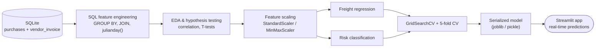

# VENDOR-INVOICE-INTELLIGENCE-SYSTEM
<div align="center">

# 🧾 Vendor Invoice Intelligence System

</div>

---

## 🎯 The 30-second pitch

Finance teams processing thousands of vendor invoices face two recurring headaches: **"what should this freight charge actually cost?"** and **"is this invoice hiding a mismatch someone needs to catch?"**

This project answers both with a single ML pipeline that goes from raw SQL tables → engineered features → statistically validated models → a live Streamlit tool finance teams can actually click through.

| Problem | Solution | Outcome |
|---|---|---|
| Freight costs are guessed, not calculated | Regression model trained on invoice + purchase history | Instant, consistent cost estimates |
| Risky invoices slip through manual review | Classifier trained on delay + mismatch signals | Invoices auto-tagged ✅ Safe or ⚠️ Review |

---

## 🗺️ How data flows through the system



---

## 🧠 Why this isn't "just another sklearn notebook"

- **Labels weren't handed to us** — invoice risk had no ground truth, so labels were derived with a rule-based heuristic (*mismatch OR avg. delay > 10 days*) before any model was trained.
- **Features earned their place** — every candidate feature was run through a T-test; anything with p > 0.05 (like `days_to_pay`, `total_brands`) was cut rather than left in for the model to shrug at.
- **Dates were computed, not assumed** — receiving delay, PO-to-invoice lag, and payment lag were all derived using SQLite's `julianday()`, straight from string-typed date columns.
- **Tuning was systematic** — `GridSearchCV` swept `criterion`, `max_depth`, `min_samples_split/leaf`, and `n_estimators` under 5-fold cross-validation rather than hand-picked defaults.

---

## 🖥️ The application

Two modules, one shared model backend:

### 1️⃣ Freight cost prediction
| Input | Description |
|---|---|
| Invoice quantity | Number of items on the invoice |
| Invoice dollars | Total invoice value |

**→ Output:** predicted freight cost in real time.

### 2️⃣ Invoice risk flagging
| Input | Description |
|---|---|
| Quantities & dollars | Invoice vs. purchase-order totals |
| Freight cost | Freight component of the invoice |
| Delay features | Receiving / payment delay signals |

**→ Output:** `✅ Safe invoice` or `⚠️ Manual review required`.

> 📸 *Drop your screenshots here:*
> `screenshots/freight_prediction.png` · `screenshots/invoice_flagging.png`
> 🎥 *Drop your demo video/GIF link here.*

---

## 🔬 From raw tables to a trained model

**Source:** a relational SQLite database with two core tables.

<table>
<tr><td>

**`purchases`**
- Purchase order number
- Quantity / dollars
- Receiving & PO dates
- Brand info

</td><td>

**`vendor_invoice`**
- Invoice quantity / dollars
- Freight cost
- Invoice & payment dates

</td></tr>
</table>

Extracted via `pd.read_sql_query()` using `SUM()`, `AVG()`, `COUNT()`, `GROUP BY`, and `LEFT JOIN`.

**Engineered features** included total item quantity/dollars, total brands, average receiving delay, PO→invoice lag, and days-to-payment — all validated statistically before modeling (see below).

### Statistical validation, not vibes

| Step | Method | Decision rule |
|---|---|---|
| Feature significance | Two-sample T-test (risky vs. normal) | Keep if p < 0.05 |
| Feature importance | Random Forest importances | Drop lowest-signal features |
| Scaling | StandardScaler / MinMaxScaler | Applied before model fit |

---

## 🤖 Models & tuning

| Model | Role |
|---|---|
| Logistic Regression | Baseline |
| Decision Tree Classifier | Interpretable rule-based check |
| **Random Forest Classifier** | **Final production model** |

Tuned with `GridSearchCV` over `criterion`, `max_depth`, `min_samples_split`, `min_samples_leaf`, and `n_estimators`, validated with **5-fold cross-validation** to keep the model from overfitting to one slice of invoices.

## 📊 Model results

<div align="center">

| Metric | Result |
|:---|:---:|
| **Final accuracy** | **89%** |
| Best model | Random Forest Classifier |
| False positives | Reduced vs. baseline |
| Feature set | Trimmed via T-test + importance ranking |

</div>

---

## 🧰 Tech stack

| Layer | Tools |
|---|---|
| Language | Python |
| Data wrangling | Pandas, NumPy |
| Database | SQLite |
| Modeling | Scikit-learn |
| Tuning | GridSearchCV, cross-validation |
| Visualization | Matplotlib, Seaborn |
| Serving | Streamlit |
| Serialization | Joblib / Pickle |

---

## 📁 Project structure

```
Vendor-Invoice-Intelligence-System/
│
├── invoice_flagging/
│   ├── data_preprocessing.py
│   ├── modeling_evaluation.py
│   ├── train.py
│   ├── models/
│   └── inference/
│
├── app.py
├── notebooks/
├── screenshots/
└── requirements.txt
```

**Training pipeline:** load data → derive labels → engineer features → scale → train → tune → evaluate → serialize best model.

**Inference pipeline:** load saved model → accept new invoice inputs → return predictions in real time — the same shape a production system would use.

---

## ⚡ Quickstart

```bash
git clone https://github.com/<your-username>/Vendor-Invoice-Intelligence-System.git
cd Vendor-Invoice-Intelligence-System
pip install -r requirements.txt
streamlit run app.py
```

---

## 📚 What this project sharpened

**Technical:** SQL feature engineering, hypothesis-driven feature selection, classification modeling, hyperparameter tuning, cross-validation, model serialization, inference pipelines, Streamlit deployment.

**Business:** how a rule-based label, a T-test, and a tuned classifier combine into a decision-support tool finance teams would actually trust.

---

## ✅ Conclusion

An end-to-end pipeline — SQL → statistics → tuned Random Forest → Streamlit — that predicts freight cost and flags risky invoices at **89% accuracy**, built to mirror how a real finance-ops ML system would be structured, tested, and shipped.

---

<div align="center">

### 👤 Author

**Your Name** — feel free to connect
[GitHub](#) · [LinkedIn](#) · [Portfolio](#)

⭐ If this project was useful or interesting, consider starring the repo!

</div>
