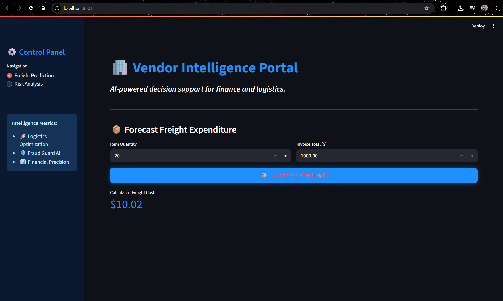
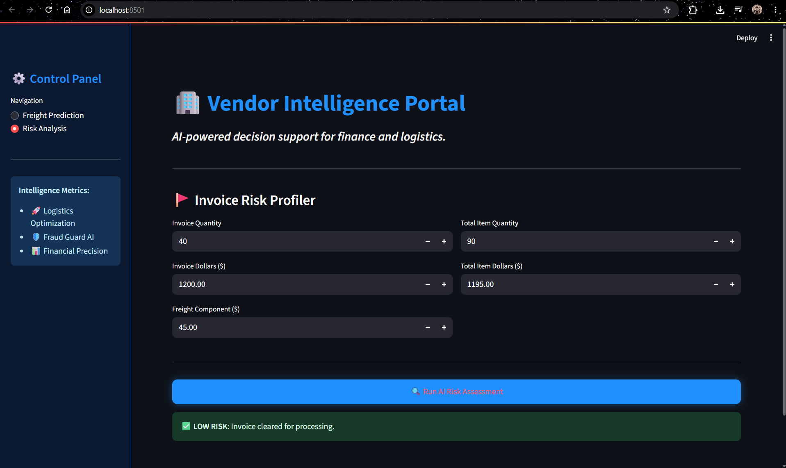

<div align="center">

# 🧾 Vendor Invoice Intelligence System

**An end-to-end ML pipeline for freight cost prediction and invoice risk detection**

</div>

## 🧩 Skills used

<div align="center">


</div>

### 📸 Preview

<table>
<tr>
<td width="50%">

**Freight cost prediction**


</td>
<td width="50%">

**Invoice risk flagging**


</td>
</tr>
</table>

### 🎬 Demo Video

<div align="center">

[](https://youtu.be/AlrBu6p75iI?si=2LGLg4Wab4k2HjBT)

*Click the thumbnail above to watch a full walkthrough of the app in action.*

</div>

> 💡 Replace the link above with your actual demo video URL (YouTube, Loom, or a Google Drive share link). If you'd rather embed a local file, you can also add a short GIF here using ``.

---

## 📖 About the Project

Finance teams processing high volumes of vendor invoices routinely face two costly, manual bottlenecks: estimating freight charges without a consistent basis, and catching invoice discrepancies before payment goes out. Left unchecked, these gaps lead to inconsistent cost forecasting and payments issued against invoices with hidden mismatches or unusual delays.

**Vendor Invoice Intelligence System** is an end-to-end machine learning pipeline built to solve both problems in a single workflow — taking raw purchase and invoice data from a relational database, transforming it through statistically validated feature engineering, and surfacing predictions through a live, interactive application finance teams can actually use.

The system tackles two distinct tasks:

- **Freight Cost Prediction** — a regression model that estimates the expected freight cost of an invoice based on quantity and dollar value, replacing guesswork with a consistent, data-driven estimate.
- **Invoice Risk Flagging** — a classification model that flags invoices likely to need manual review, based on delay patterns and quantity/dollar mismatches between purchase orders and invoices.

Since no ground-truth "risk" label existed in the raw data, one was engineered using a rule-based heuristic (mismatch OR average delay > 10 days) before any model was trained — a deliberate step to ensure the classifier learned from meaningful signal rather than arbitrary noise. Every candidate feature was validated through hypothesis testing (T-tests) and Random Forest importance rankings before being included, and both models were tuned via `GridSearchCV` with 5-fold cross-validation rather than relying on hand-picked defaults.

The final Random Forest classifier achieves **89.54% accuracy**, and both models are served through a real-time **Streamlit** application — built to mirror how a finance-ops ML system would actually be structured, validated, and shipped in production.

---

## 🎯 Business Problem

Finance teams processing thousands of vendor invoices face two recurring headaches: **"what should this freight charge actually cost?"** and **"is this invoice hiding a mismatch someone needs to catch?"**

This project answers both with a single ML pipeline that goes from raw SQL tables → engineered features → statistically validated models → a live Streamlit tool finance teams can actually click through.

| Problem | Solution | Outcome |
|---|---|---|
| Freight costs are guessed, not calculated | Regression model trained on invoice + purchase history | Instant, consistent cost estimates |
| Risky invoices slip through manual review | Classifier trained on delay + mismatch signals | Invoices auto-tagged ✅ Safe or ⚠️ Review |

---

## 🗺️ How data flows through the system


---

## 🖥️ The application

Two modules, one shared model backend:

### 1️⃣ Freight cost prediction
| Input | Description |
|---|---|
| Invoice quantity | Number of items on the invoice |
| Invoice dollars | Total invoice value |

**→ Output:** predicted freight cost in real time.

### 2️⃣ Invoice risk flagging
| Input | Description |
|---|---|
| Quantities & dollars | Invoice vs. purchase-order totals |
| Freight cost | Freight component of the invoice |
| Delay features | Receiving / payment delay signals |

**→ Output:** `✅ Safe invoice` or `⚠️ Manual review required`.

---

## 🔬 From raw tables to a trained model

**Source:** a relational SQLite database with two core tables.

📦 **Dataset download:** [Google Drive folder](https://drive.google.com/drive/folders/1lcpbeSh59qi5EgXZpt9dt8K1kf4EY6c6?usp=drive_link)
> The raw `.db` file isn't committed to this repo — download it from the link above and place it in the project root (or update the path in `data_preprocessing.py`) before running the training pipeline.

<table>
<tr><td>

**`purchases`**
- Purchase order number
- Quantity / dollars
- Receiving & PO dates
- Brand info

</td><td>

**`vendor_invoice`**
- Invoice quantity / dollars
- Freight cost
- Invoice & payment dates

</td></tr>
</table>

Extracted via `pd.read_sql_query()` using `SUM()`, `AVG()`, `COUNT()`, `GROUP BY`, and `LEFT JOIN`.

**Engineered features** included total item quantity/dollars, total brands, average receiving delay, PO→invoice lag, and days-to-payment — all validated statistically before modeling (see below).

### Statistical validation, not vibes

| Step | Method | Decision rule |
|---|---|---|
| Feature significance | Two-sample T-test (risky vs. normal) | Keep if p < 0.05 |
| Feature importance | Random Forest importances | Drop lowest-signal features |
| Scaling | StandardScaler / MinMaxScaler | Applied before model fit |

---

## 🤖 Models & tuning

| Model | Role |
|---|---|
| Logistic Regression | Baseline |
| Decision Tree Classifier | Interpretable rule-based check |
| **Random Forest Classifier** | **Final production model** |

Tuned with `GridSearchCV` over `criterion`, `max_depth`, `min_samples_split`, `min_samples_leaf`, and `n_estimators`, validated with **5-fold cross-validation** to keep the model from overfitting to one slice of invoices.

## 📊 Model results

<div align="center">

| Metric | Result |
|:---|:---:|
| **Final accuracy** | **89.54%** |
| Best model | Random Forest Classifier |
| False positives | Reduced vs. baseline |
| Feature set | Trimmed via T-test + importance ranking |

</div>

---

## 🧰 Tech stack

| Layer | Tools |
|---|---|
| Language | Python |
| Data wrangling | Pandas, NumPy |
| Database | SQLite |
| Modeling | Scikit-learn |
| Tuning | GridSearchCV, cross-validation |
| Visualization | Matplotlib, Seaborn |
| Serving | Streamlit |
| Serialization | Joblib / Pickle |

---

## 📁 Project structure

```
Vendor-Invoice-Intelligence-System/
│
├── invoice_flagging/
│   ├── data_preprocessing.py
│   ├── modeling_evaluation.py
│   ├── train.py
│   ├── models/
│   └── inference/
│
├── app.py
├── notebooks/
├── ScreenShots/
└── requirements.txt
```

**Training pipeline:** load data → derive labels → engineer features → scale → train → tune → evaluate → serialize best model.

**Inference pipeline:** load saved model → accept new invoice inputs → return predictions in real time — the same shape a production system would use.

---

## ⚡ Quickstart

```bash
git clone https://github.com/harshit4v/Vendor-Invoice-Intelligence-System.git
cd Vendor-Invoice-Intelligence-System
pip install -r requirements.txt
```

> 📦 Download the SQLite database from the [dataset link](https://drive.google.com/drive/folders/1lcpbeSh59qi5EgXZpt9dt8K1kf4EY6c6?usp=drive_link) and place it in the project root before running the app.

```bash
streamlit run app.py
```

---

## 📚 What this project sharpened

**Technical:** SQL feature engineering, hypothesis-driven feature selection, classification modeling, hyperparameter tuning, cross-validation, model serialization, inference pipelines, Streamlit deployment.

**Business:** how a rule-based label, a T-test, and a tuned classifier combine into a decision-support tool finance teams would actually trust.

---

## ✅ Conclusion

An end-to-end pipeline — SQL → statistics → tuned Random Forest → Streamlit — that predicts freight cost and flags risky invoices at **89.54% accuracy**, built to mirror how a real finance-ops ML system would be structured, tested, and shipped.

---

<div align="center">

### 👤 Author

**Harshit Verma** — feel free to connect
[GitHub](https://github.com/harshit4v) · [LinkedIn](https://www.linkedin.com/in/harshitverma1415/)

⭐ If this project was useful or interesting, consider starring the repo!

</div>
